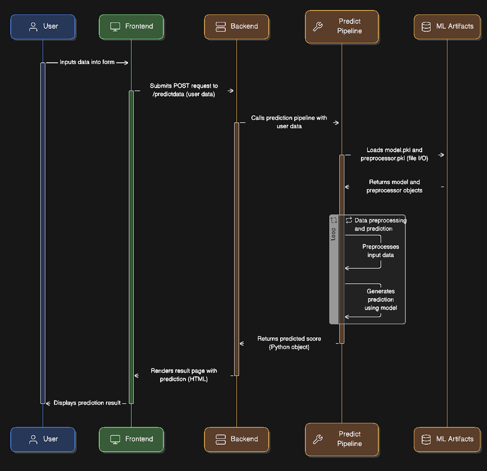

# 🚀 End-to-End Student Success Predictor 🚀


This isn't just another Jupyter Notebook. This is a fully containerized, end-to-end machine learning application that brings a predictive model to life. It's designed to predict a student's math score based on demographic and academic factors, all served through a clean, interactive web interface.

---

## ✨ Live Demo & System Design

Why just read about it when you can see it in action?

*   **Try the Live Application:** [**Student Success Predictor on Hugging Face Spaces**](https://huggingface.co/spaces/rathodashish10/End-to-end-student-performance-predictor)

### System Architecture
The application is designed for clarity and scalability. The entire request-response cycle, from user input to model inference, is illustrated in the sequence diagram below. This isn't just code; it's engineered software.



---

## 🎯 The Problem & The Solution

In the educational sector, identifying students who might need extra support is crucial. This project tackles that challenge by leveraging machine learning to provide data-driven insights. By predicting math performance, educators can proactively intervene and provide the necessary resources, fostering a better learning environment for everyone.

---

## 🛠️ Technology Stack & Tools

This project was built using a modern, industry-standard stack:

*   **🐍 Backend:** **Flask** (A powerful micro-framework for building the web server and API)
*   **🤖 Machine Learning:** **Scikit-learn**, **Pandas**, **NumPy**, and **XGBoost** (For data manipulation, preprocessing, and building a robust prediction model)
*   **🎨 Frontend:** **HTML** & **CSS** (For a clean and simple user interface)
*   **🚀 Deployment & DevOps:** **Docker** (For containerizing the application to ensure consistency) and **Hugging Face Spaces** (For seamless deployment and hosting)
*   **💻 Code & Version Control:** **Git** & **GitHub**

---

## 📋 Key Features

*   **Seamless User Experience:** A simple, intuitive web form for data entry. No complex commands needed.
*   **Real-time Inference:** The XGBoost model provides predictions instantly upon submission.
*   **Modular & Scalable Codebase:** The project is structured with a clear separation of concerns (Flask app, prediction pipeline, utilities), making it easy to maintain and extend.
*   **Reproducible Environment:** Thanks to Docker and a detailed `requirements.txt`, anyone can replicate the exact environment and run the project flawlessly.

---

## 🏁 Getting Started on Your Local Machine

Want to run this project yourself? Here’s how you can get it up and running in minutes.

### Prerequisites
*   You have Git installed.
*   You have Python 3.9 or a newer version.

### Installation & Execution

1.  **Clone the Repository:**
    ```bash
    git clone https://github.com/AshishRathodDev/End-to-End-Student-Success-Analytics.git
    cd End-to-End-Student-Success-Analytics
    ```

2.  **Create and Activate a Virtual Environment:**
    ```bash
    # Create the environment
    python3 -m venv .venv

    # Activate it (macOS/Linux)
    source .venv/bin/activate
    
    # Or on Windows
    # .venv\Scripts\activate
    ```

3.  **Install Dependencies:**
    ```bash
    pip install -r requirements.txt
    ```

4.  **Launch the Application:**
    ```bash
    python application.py
    ```
    Your application is now live! Open your browser and go to **`http://127.0.0.1:5000`**.

---

## 💡 Future Roadmap

This project is a solid foundation, but there's always room to grow. Here are a few ideas for future enhancements:

*   [ ] **CI/CD Pipeline:** Implement GitHub Actions to automatically test and deploy new changes.
*   [ ] **User Accounts & History:** Allow users to create accounts and view their past predictions.
*   [ ] **Model Monitoring:** Integrate tools to monitor model performance and detect data drift over time.
*   [ ] **A/B Testing:** Deploy multiple models simultaneously to see which one performs best in a live environment.

---
Feel free to clone, experiment, and reach out with any questions!